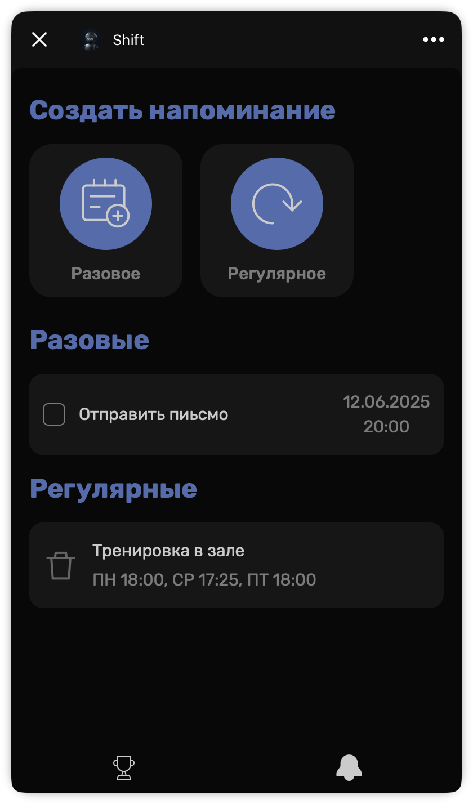

# Shift

**Telegram Bot for Building Habits & Managing Reminders.**

---

## Overview

Shift is a Telegram Bot with a Mini App that helps users build positive habits and quit harmful ones through a
structured, five-stage workflow, based on _“Changeology: 5 Steps to Realizing Your Goals and Resolutions”_ by John
Norcross. The
core idea is to guide users step by step, track progress, and send timely
notifications for habits within Telegram. Shift also supports one-time and recurring reminders so users don’t forget
important tasks.

  
  

---

## Tech Stack

- **Backend:** FastAPI, Uvicorn, SQLAlchemy (SQLite), APScheduler
- **Telegram Bot:** aiogram
- **Frontend:** HTML, CSS, JavaScript
- **Hosting:** [Vercel](https://vercel.com) (Mini App), VPS from [Timeweb Cloud](https://timeweb.cloud) (server & bot)

---

## Installation and Setup

### For users

Just click on the [link](https://t.me/your_shift_bot) to get started.

### For developers

1. Rent a VPS/VDS server with Linux and assign the URL address to this server.
2. Create Telegram Bot via [BotFather](https://t.me/BotFather).
3. Clone this repository.
4. Open `WebApp/tools/networking_tools.js` and replace `server_url` with your server’s URL (from step 1).
5. Deploy the frontend (the `WebApp` folder) to your hosting. For example, you can use [Vercel](https://vercel.com).
   Once deployed, note the public URL.
6. Go to the `Server` folder (it is at the root of the project) and rename `.env.example` to `.env`.
7. Go to the `TelegramBot` folder (it is at the root of the project) and put the real data
   to `.env.example`: `BOT_TOKEN` (from step 2) and `WEBAPP_URL`(from step 5).
8. Rename `.env.example` to `.env`.
9. Execute `apt install python3.10-venv`
10. Execute `./install` (it is at the root of the project). After installation, the FastAPI server will run on port `9091`, and the Telegram Bot will use port 9092.